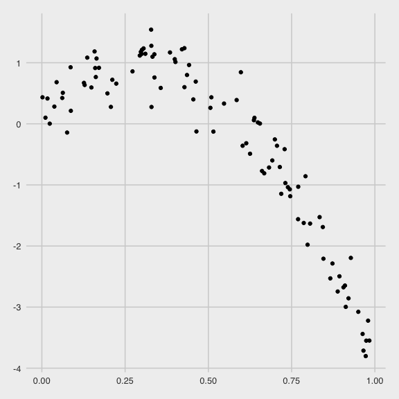
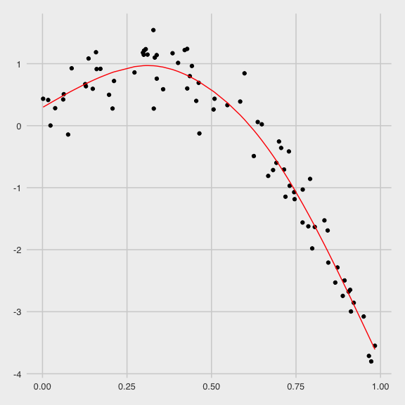
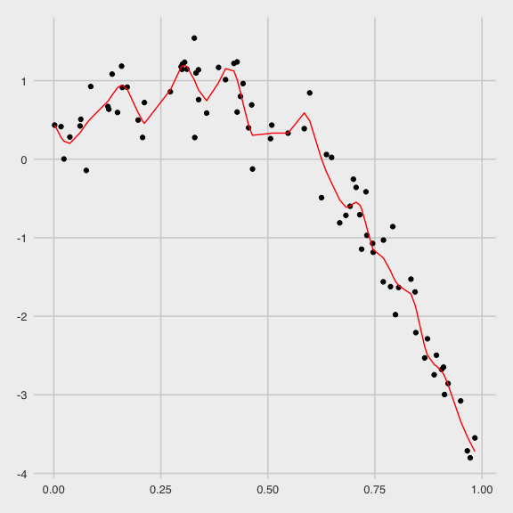
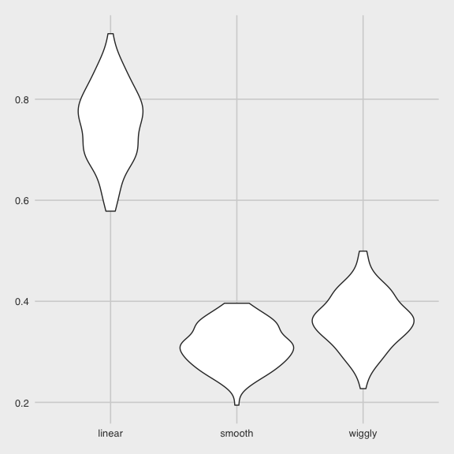

Cross-Validation
================
Alexey Abramov
11/24/2020

  - [Setup](#setup)
  - [Simulated dataset](#simulated-dataset)
      - [Cross- validation](#cross--validation)
  - [Cross-validation with modelr
    package](#cross-validation-with-modelr-package)
  - [Loading the data.](#loading-the-data.)

# Setup

``` r
library(tidyverse)
```

    ## ── Attaching packages ───────────────────────────────────────────────────────── tidyverse 1.3.0 ──

    ## ✓ ggplot2 3.3.2     ✓ purrr   0.3.4
    ## ✓ tibble  3.0.3     ✓ dplyr   1.0.2
    ## ✓ tidyr   1.1.2     ✓ stringr 1.4.0
    ## ✓ readr   1.3.1     ✓ forcats 0.5.0

    ## ── Conflicts ──────────────────────────────────────────────────────────── tidyverse_conflicts() ──
    ## x dplyr::filter() masks stats::filter()
    ## x dplyr::lag()    masks stats::lag()

``` r
library(p8105.datasets)
library(modelr)
library(mgcv)
```

    ## Loading required package: nlme

    ## 
    ## Attaching package: 'nlme'

    ## The following object is masked from 'package:dplyr':
    ## 
    ##     collapse

    ## This is mgcv 1.8-33. For overview type 'help("mgcv-package")'.

``` r
knitr::opts_chunk$set(
  fig.width = 6,
  fig.height = 6,
  out.width = "90%"
)

theme_set(
  ggthemes::theme_fivethirtyeight() + theme(legend.position = "bottom")
  )

options(
  ggplot2.continuous.colour = "viridis",
  ggplot2.continuous.colour = "viridis"
)

scale_colour_discrete = scale_color_viridis_d
scale_fill_discrete = scale_fill_viridis_d
```

# Simulated dataset

``` r
nonlin_df = 
  tibble(
    id = 1:100,
    x = runif(100, 0, 1),
    y = 1 - 10 * (x - .3) ^ 2 + rnorm(100, 0, .3)
  )
```

``` r
nonlin_df %>% 
  ggplot(aes(x = x, y = y)) +
  geom_point() 
```



## Cross- validation

Get training and testing datasets.

``` r
train_df = sample_n(nonlin_df, size = 80)
test_df = anti_join(nonlin_df, train_df, by = "id")
```

Fit three models

``` r
linear_mod = lm(y ~ x, data = train_df)
smooth_mod = gam(y ~ s(x), data = train_df)
wiggly_mod = gam(y ~ s(x, k = 30), sp = 10e-6, data = train_df)
```

Let’s see this graphically

Linear

``` r
train_df %>% 
  add_predictions(linear_mod) %>% 
  ggplot(aes(x = x, y = y)) +
  geom_point() +
  geom_line(aes(y = pred), color = "red")
```


Smooth

``` r
train_df %>% 
  add_predictions(smooth_mod) %>% 
  ggplot(aes(x = x, y = y)) +
  geom_point() +
  geom_line(aes(y = pred), color = "red")
```



Wiggly

``` r
train_df %>% 
  add_predictions(wiggly_mod) %>% 
  ggplot(aes(x = x, y = y)) +
  geom_point() +
  geom_line(aes(y = pred), color = "red")
```



Multiple predictions? Sure. Let’s see all of them.

``` r
train_df %>% 
  gather_predictions(linear_mod, smooth_mod, wiggly_mod) %>% 
  ggplot(aes(x = x, y = y)) +
  geom_point() +
  geom_line(aes(y = pred), color = "red") + 
  facet_grid(. ~ model)
```


Now considering prediction accurary.

``` r
rmse(linear_mod, test_df)
```

    ## [1] 0.6551062

``` r
rmse(smooth_mod, test_df)
```

    ## [1] 0.3238845

``` r
rmse(wiggly_mod, test_df)
```

    ## [1] 0.3413744

# Cross-validation with modelr package

``` r
cv_df = 
  crossv_mc(nonlin_df, 100)
```

What is happening here… And then we bring it out and show it as a tibble
so we can see the lists and dataframes.

``` r
cv_df %>% pull(train) %>% .[[1]] %>% as_tibble()
```

    ## # A tibble: 79 x 3
    ##       id      x       y
    ##    <int>  <dbl>   <dbl>
    ##  1     2 0.560   0.0800
    ##  2     3 0.234   0.727 
    ##  3     4 0.0512  0.922 
    ##  4     5 0.429   0.894 
    ##  5     6 0.216   1.72  
    ##  6     7 0.911  -2.41  
    ##  7     8 0.181   0.894 
    ##  8    10 0.528   0.723 
    ##  9    12 0.628   0.152 
    ## 10    13 0.252   0.583 
    ## # … with 69 more rows

This step is only necessary for the gam function which requires a
tibble, and won’t work for list columns.

``` r
cv_df =
  cv_df %>% 
  mutate(
    train = map(train, as_tibble),
    test = map(test, as_tibble)
    )
```

Let’s try to fit models and get RMSEs for them. map2 is used because we
have two inputs into our iteration argument.

map2\_dbl is a way to see the actual number.

``` r
cv_df = 
  cv_df %>% 
  mutate(
    linear_mod = map(.x = train, ~lm(y ~ x, data = .x)),
    smooth_mod = map(.x = train, ~gam(y ~ s(x), data = .x)),
    wiggly_mod = map(.x = train, ~gam(y ~ s(x, k = 30), sp = 10e-6, data = .x))
    ) %>% 
  mutate(
    rmse_linear = map2_dbl(.x = linear_mod, .y = test, ~rmse(model = .x, data = .y)),
    rmse_smooth = map2_dbl(.x = smooth_mod, .y = test, ~rmse(model = .x, data = .y)),
    rmse_wiggly = map2_dbl(.x = wiggly_mod, .y = test, ~rmse(model = .x, data = .y))
  )
```

What do these results say about the model choices?

``` r
cv_df %>% 
  select(starts_with("rmse")) %>% 
  pivot_longer(
    everything(),
    names_to = "model",
    values_to = "rmse",
    names_prefix = "rmse_"
  ) %>% 
  ggplot(aes(x = model, y = rmse)) +
  geom_violin()
```



The smooth model appears to be doing better.

``` r
cv_df %>% 
  select(starts_with("rmse")) %>% 
  pivot_longer(
    everything(),
    names_to = "model",
    values_to = "rmse",
    names_prefix = "rmse_"
  ) %>% 
  group_by(model) %>% 
  summarize(avg_rmse = mean(rmse))
```

    ## `summarise()` ungrouping output (override with `.groups` argument)

    ## # A tibble: 3 x 2
    ##   model  avg_rmse
    ##   <chr>     <dbl>
    ## 1 linear    0.751
    ## 2 smooth    0.312
    ## 3 wiggly    0.363

# Loading the data.

``` r
data("nyc_airbnb")

nyc_airbnb =
  nyc_airbnb %>% 
    mutate(
      stars = review_scores_location/ 2) %>% 
  rename(
      borough = neighbourhood_group,
      neighborhood = (neighbourhood)) %>% 
  filter(borough != "Staten Island") %>% 
  select(price, stars, borough, neighborhood, room_type)
```
